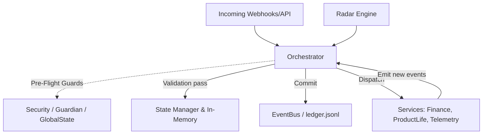

# System Architecture Map (Phase 1 Baseline)

## 1. Project Structure Overview
The `autonomous-system-v2` project is a fully event-sourced backend application utilizing Python, operating on a unified monolithic pattern. The repository is clearly demarcated by functional layers that enforce immutability and state-machine separation.

**Core Directories:**
- `api/`: Flask application, housing incoming webhooks, health endpoints, and UI dashboard routes.
- `core/`: The absolute brain of the architecture. Houses the `Orchestrator`, `EventBus`, `StateManager`, and primary constitutional engines (`StrategicOpportunityEngine`, `FinanceEngine`, `TelemetryEngine`).
- `engines/`: Auxiliary engines representing product lifecycle states, beta validations, and loop management. Note: Some legacy fragments exist here.
- `infra/`: Pure, functional integration wrappers for external comms (`llm`, `finance`, `rss`, `landing`, `guardian`). Contains bounded-context logic decoupled from system state.
- `infrastructure/`: Database/persistence adapters (File, EventLog, JSON configurations) and system logging.
- `radar/`: The autonomous idea detection layer. Fully isolated pipeline gathering multi-source signals and resolving into `RadarDatasetSnapshots`.

## 2. Module Architecture Map
- **The Orchestrator (`core/orchestrator.py`)**: The central routing nervous system. It holds the only authorized lock to mutate state (`StateManager`). All system modifications process through `receive_event()`.
- **The Guardian Layer (`infra/guardian/` & `core/guardian_engine.py`)**: Real-time interceptors ensuring events do not violate financial or technical rules.
- **The State Machine (`core/state_machine.py`)**: Validates logical transitions (e.g. `Idea` -> `Beta` -> `Ativo`).
- **Telemetry & Finance (`core/telemetry_engine.py` & `core/finance_engine.py`)**: Immutable ledgers for calculating product effectiveness (ROAS, RPM, CAC) and freezing capital allocation when entering `CONTENÇÃO_FINANCEIRA`.

## 3. Dependency Graph

## 4. Event Flow Analysis
The system enforces a **C5.3 Event-Sourcing pattern**:
1. External or internal systems invoke `receive_event("event_type", payload)`.
2. The Orchestrator applies idempotency index tracking and locks the transaction.
3. Pre-flight scans check for macro exposure constraints or manual product pauses.
4. Internal handlers update the nested dictionaries inside the in-memory `StateManager`.
5. Upon success, the `EventBus` permanently appends the formal payload to `ledger.jsonl` maintaining strict chronological immutability.

## 5. Persistence Layer Analysis
There is no unified SQL/NoSQL database. Storage is heavily chunked across functional flat-files.
- **`ledger.jsonl`**: The immutable truth. Holds all system transactions.
- **`state.json`**: Hydrated system variables and temporary session locks.
- **`radar_snapshots.jsonl`**: Permanent static storage of market discovery data.
- **`telemetry_accumulators.json`**: Resumable working memory for live traffic/revenue signals.

## 6. Integration Map
- **Revenue Context**: Handled via `stripe_adapter.py` passing signals to `core.finance_engine`.
- **LLM Context**: Bound through `infra/llm/llm_client.py` incorporating budget guards to prevent token overflow. Connects to OpenAI.
- **Communications Context**: Transactional emails mapped defensively into Resend APIs.
- **Market Context**: Radar connects to Serper (Google Intention), ProductHunt SDK, Reddit OAuth, and PyTrends.

## 7. Environment Variables Map
(Credentials successfully scrubbed, integration structures verified via `.env` footprint)
- **Primary AI/Compute**: `OPENAI_API_KEY`
- **Clearinghouse/Billing**: `STRIPE_SECRET_KEY`, `PAYMENT_API_KEY`, `WEBHOOK_SECRET`
- **Communications**: `RESEND_API_KEY`, `EMAIL_FROM`
- **Deployment & Scaling**: `VERCEL_API_TOKEN`, `PORT`.
- **Analytics**: GA4 mappings via `GOOGLE_APPLICATION_CREDENTIALS`.

## 8. Deployment Structure
- Bootstrapped via `production_launcher.py`, creating the root `Orchestrator` instance and propagating it through `.register_service()`.
- Cloud configuration via `vercel.json` exposing the `(.*)` routing wildcard.
- Support for PaaS/Docker deployments via standard `Procfile` targeting Python processes.

## 9. Potential Risks
- **Concurrency Bottlenecks**: High traffic bursts could choke `ledger.jsonl` as the `threading.RLock()` in Orchestrator is purely synchronous.
- **Duplicate Artefacts**: Noticed ghost-files like `engines/telemetry_engine.py` (empty) competing visually with `core/telemetry_engine.py` (production).
- **Split Brain Storage**: Segmenting state into 15+ micro-JSON ledgers creates risk if one write operation succeeds while another (e.g. `finance_projections.json`) errors out post-loop. The transaction wrapper only covers `ledger.jsonl` cleanly.

## 10. Missing Components
- Deep database abstraction layer (ORMs). The application operates highly functionally on disk structures. No Redis cache exists for standard volatile locking.
- Test suites have partial coverage but many system integration tests still point to the deprecated V1 `/tests/` scaffolds.

## 11. Observations relevant for the upcoming implementation phases
The architecture is exceptionally rigid and follows its Constitutional rules strictly. 
Moving into **Phase 2 (Governance Document Load)** will be primarily a semantic upgrade inside the core Guardian logic, as the underlying orchestrator natively supports deep gating rules (`macro_exposure_governance_engine.py`).
The project is structurally robust to support real market activation.
